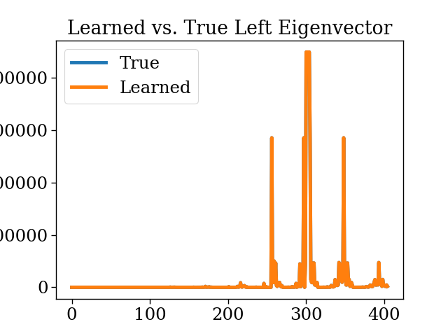

EVAL: EigenVector-based Average-reward Learning

Acrobot performance on EVAL (note logscale x axis):

![auc][scaling_logu]

And same for SB3's DQN with their hparams (huggingface):

![auc][scaling_dqn]

Model-based ground truth comparisons with tabular algorithms:




Model-free ground truth comparisons:

![eigvec][eigvec_figure]
![policy][policy_figure]

[policy_figure]: figures/policy_MF.png
[eigvec_figure]: figures/left_eigenvector_MF.png
[scaling_logu]: Acrobot-v1.png 
[scaling_dqn]: Acrobot-v1-dqn.png


For updating requirements.txt:
```
pip list --format=freeze > requirements.txt
```

the contents of requirements.txt are a bit sensitive for the git actions testing...
(e.g. have to remove some conda stuff)