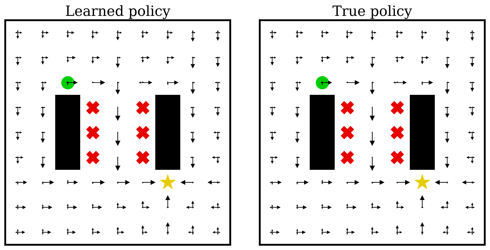

EVAL (EigenVector-based Average-reward Learning) implementation in Gymnasium's classic control and mazes.

# Simple TODOs:
- [x] "bigger" tabular expt overrides: Add Heaven & Hell experiment in the tabular case
- [x] Theory comparison overrides: Compare multilogu w/ and w/o the 1/A factor in chi calc.
- [x] Batch theta overrides: Same w/ periodic updates of ref s,a,s'
- [x] Implement LR schedule
- [x] Create a folder when one is missing for logging
- [ ] Correct log interval for PPO
# New (Simple) Features:
- [x] Monitor FPS
- [x] Monitor min/max of logu to watch for divergence
- [x] Add learning rate decay thru scheduler
- [x] Add "train_freq" rather than episodic training
- [ ] Possibly use SB3 style: :param train_freq: Update the model every ``train_freq`` steps. Alternatively pass a tuple of frequency and unit
        like ``(5, "step")`` or ``(2, "episode")``.
- [x] Add gradient clipping
- [x] More clever normalization to avoid logu divergence (just clamping)
- [x] Merge Rawlik with U as an option. e.g. prior_update_interval=0 for no updates, and otherwise use Rawlik iteration
- [x] Switch to SB3 Replay Buffer

# Experimental questions:
- [ ] Does stabilizing theta help stabilize logu? (i.e. fix theta to g.t. value)
- [ ] Test the use of clipping theta (min_reward, max_reward) and logu (no theoretical bounds, but -50/50 after norm. to avoid divergence)
- [ ] Which params most strongly affect logu oscillations?
- [ ] "..." affect logu divergence? 
- [ ] Why does using off-policy (pi0) for exploration make logu diverge?
- [x] Which activation function is best? softplus >> relu for u-learning
- [x] Which aggregration of theta is best (min/mean/max), same for logu (min is suggested to help with over-optimistic behavior)

# Features requiring experiments:
- [x] use target or online logu for exploration (greedy or not?)
- [ ] Standard prioritized replay
- [ ] Clipping theta
- [x] smooth out theta learning

# Future TODOs:
- [x] Generate requirements
- [ ] Write more tests
- [ ] V learning with cloning
- [ ] UV learning
- [x] Rawlik scheme (PPI)
- [ ] Test UV learning with steady state from tabular
- [ ] Effective temperature tracking from Rawlik

# Notes:

I added this line to the `gymnasium/envs/__init__.py` file:
```
register(
    id="Simple-v0",
    entry_point="gymnasium.envs.classic_control.simple_env:SimpleEnv",
    max_episode_steps=10,
    reward_threshold=1.0,
)
```
I also placed "simple_env" in classic control folder.

- Life saver for mujoco setup: https://pytorch.org/rl/reference/generated/knowledge_base/MUJOCO_INSTALLATION.html

- Important line when facing GL error: export MUJOCO_GL="glfw"

Acrobot performance on logu (note logscale x axis):

![auc][scaling_logu]

And same for SB3's DQN with their hparams (huggingface):

![auc][scaling_dqn]

Model-based ground truth comparisons with tabular algorithms:




Model-free ground truth comparisons:

![eigvec][eigvec_figure]
![policy][policy_figure]

[policy_figure]: figures/policy_MF.png
[eigvec_figure]: figures/left_eigenvector_MF.png
[scaling_logu]: Acrobot-v1.png 
[scaling_dqn]: Acrobot-v1-dqn.png


For updating requirements.txt:
```
pip list --format=freeze > requirements.txt
```

the contents of requirements.txt are a bit sensitive for the git actions testing...
(e.g. have to remove some conda stuff)
